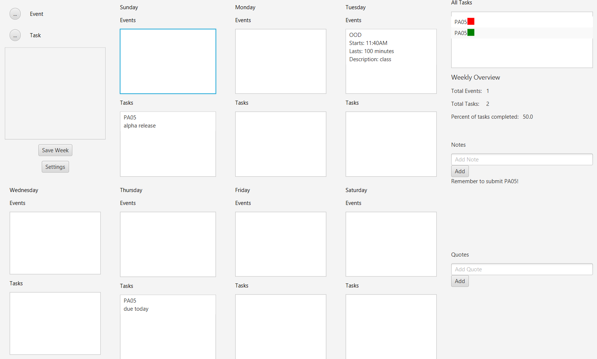

# 3500 PA05 Project Repo

[PA Write Up](https://markefontenot.notion.site/PA-05-8263d28a81a7473d8372c6579abd6481)

# Java Journal Pitch
PA05-the-best-team-pt2’s Java Journal is an efficient, simple to use calendar app for all your journaling needs! 
Your session begins by creating a new week or, if you have used Java Journal before, you can open up one of your 
previously saved weekly journals. Within the app, you can easily schedule new tasks and events to any given day by
pressing either the “add task” or “add event” button within the settings panel on the top left. Once added, your new 
task or event will pop up under the “task” or “event” section under its corresponding day panel. Any links associated 
with your task or event will be hyperlinked for easy access within the day view. Made a mistake when adding a task?
No problem! You can easily edit any tasks or events by tapping on it (this reopens the add task screen). 
Additionally, we’ve included a compiled list of all your tasks for the week in the “task queue” panel on the far right!
Your Java Journal can also be personalized through the settings. There, you can change your theme : dark, light, 
or colorful! You can also select how you want your tasks and events to be ordered: by name or duration. Once you’ve 
completed your journaling session, you can save your week. Once saved, your .bujo file will pop up in the menu when 
beginning your next journaling session! 

# Extending the application
One possible feature we could add to enhance our application is the Custom Themes feature. We could do this by adding a
new pop-up controller that has buttons to let the user change the colors and fonts around the view. We would also need
to update ThemeJson so that it contains information about the user's custom theme so that it is saved in the .bujo file.
In the settings controller, adding a custom theme would create a new button to select that theme from the list of
themes.

# Works Cited 
Splash Screen Image:
-  https://www.dreamstime.com/stock-illustration-vector-sketch-loose-leaf-calendar-white-background-image77366835!

Exploding Skull:
- https://giphy.com/gifs/bones-anatomy-skull-gif-vjjCsx3izfSyQ

Evil Skull:
- https://tenor.com/view/spin-skull-bad-to-bone-made-by-tony-maranto-gif-12512597899035017837

Dancing Skeleton:
- https://imgflip.com/gif/4h4jrr

# SOLID Principles
## Single-Responsibility Principle: 
Each of our classes and methods perform a single function. Specifically, each of our functionalities in the bullet 
journal application corresponds to its own controller class. Moreover, each data structure in our application (i.e. 
weeks, days, events, tasks, etc.) also has its own corresponding class. So, the single responsibility of these classes 
is to represent a single function/data structure. Our methods behave in the same way. For example, our extractURL method 
has the one responsibility of extracting a URL from a given String.

## Open-Closed Principle: 
We have an abstract class to represent a ‘plan’ in a calendar. This can allow for future addition of another type of 
plan to add to a calendar without having to modify the existing plans (tasks and events). Additionally, our 
PlanComparator compares two AbstractPlans by either name, duration, or default. With the addition of a future 
AbstractPlan, the code within the PlanComparator would not need to be modified, and the new AbstractPlan would get 
compared correctly.

## Liskov Substitution Principle: 
Our DialogController interface and classes that implement the interface satisfy the Liskov Substitution Principle. 
The interface contains one public method: run(). All implementing classes override this public run() method and contain no other public methods. In this way, an instance of an implementing class can be replaced by the DialogController interface, and our code would not break.

## Interface Segregation Principle: 
Our DialogController interface contains one public method: run(). This method has the purpose of performing some function decided by the implementing class. All of our classes that implement this interface need the run() method and fulfill the original purpose of run().

## Dependency Inversion Principle: 
Our DialogView has a DialogController field. This satisfies the dependency inversion principle because DialogController is an interface and, therefore, DialogView does not have a specific instance of DialogController (e.g. DialogController depends on the abstraction of a DialogController rather than an implementation). This decouples DialogView from the classes that implement DialogController.
